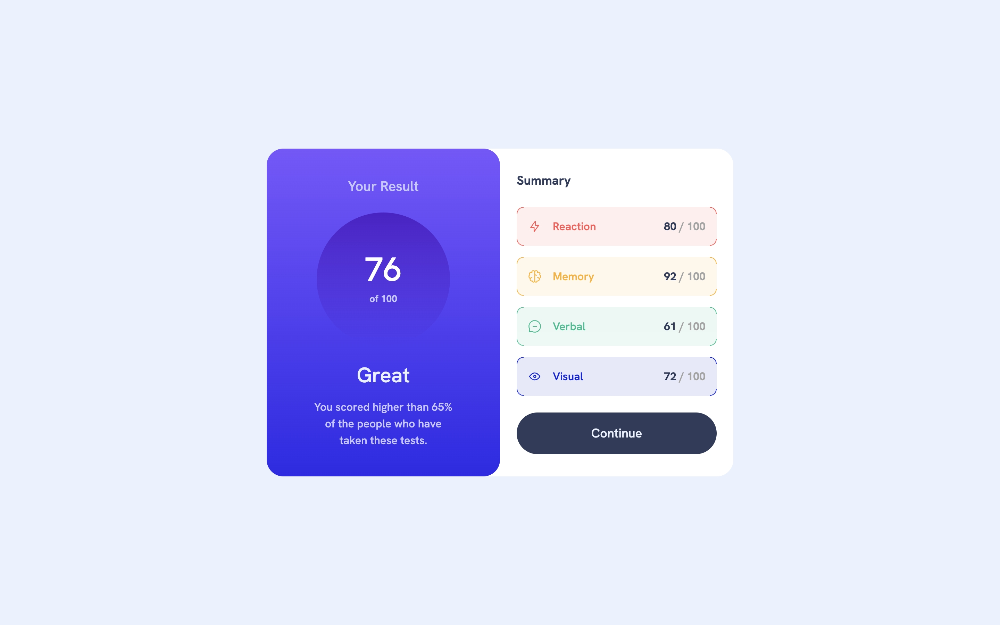
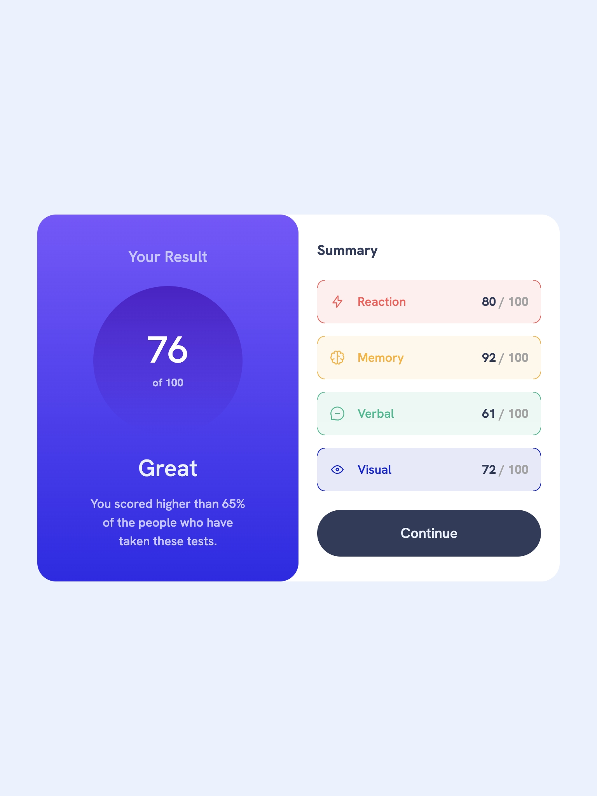

- Превью: https://kseylo.github.io/results-summary/
## Установка:

Установка зависимостей
```
pnpm install
```

Запуск
```
pnpm dev
```

## Скриншоты:
### ПК:

### Планшет:

### Телефон:

## Технологии которые использовал:
- HTML
- Tailwindcss
- Typescript

## Проблемы с которыми столкнулся:
- Угловые рамки для summary
  Решение нашел на сайте https://stackoverflow.com/questions/14387690/how-can-i-show-only-corner-borders используя градиенты, смотри в src/style.css

- Белый фон за углами your result
  Решение: Тупил где-то часик пока не додумался что в основном контейнере можно тоже установить background в белый и добавить border-radius

- Файлы которые импортируются из src/assets/images c помощью js, в production не отображались, их не было в папке dist
  Решение: Нашел в документации vite https://vitejs.dev/guide/assets#the-public-directory,
  перенес файлы в папку public 